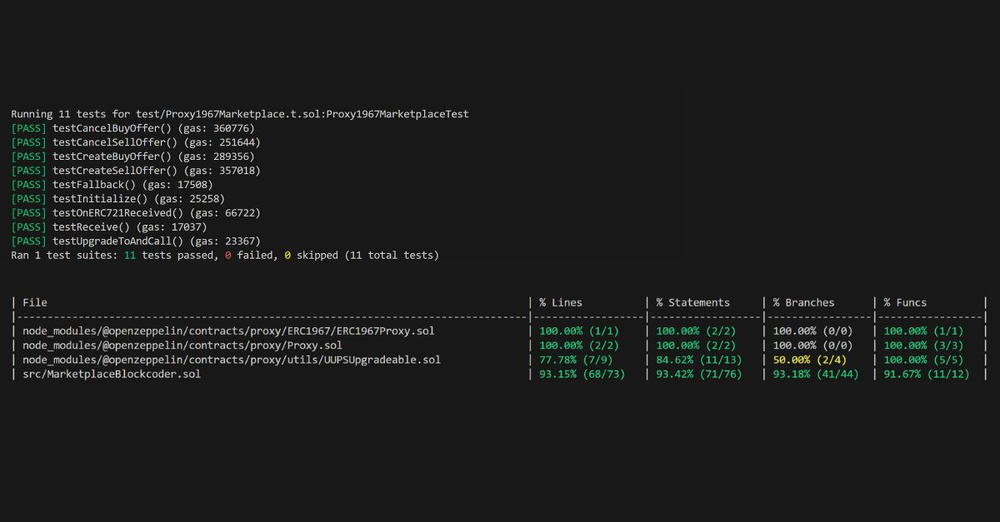

# Smart Contract: NFT Marketplace Multi-Origen (Solidity/Foundry) 📄



## Descripción

Este repositorio contiene el **contrato inteligente (Solidity)** para un marketplace descentralizado de NFTs, diseñado con la ambición de permitir a los usuarios listar y vender NFTs acuñados en *diferentes* plataformas o contratos (identificados por su dirección de contrato y Token ID). El desarrollo se centró en crear una lógica on-chain robusta, segura y actualizable mediante el uso de **proxies UUPS**.

*Nota: Este contrato fue desarrollado como proyecto final del Bootcamp Blockchain Solidity.*

## Funcionalidades Implementadas (Contrato)

* **Listado de NFTs Externos:** Lógica para que un usuario registre un NFT (indicando contrato y Token ID) para su venta en el marketplace.
* **Gestión de Precios:** Funciones para establecer y actualizar el precio de venta de los NFTs listados.
* **Mecanismo de Compra/Venta:** Orquestación segura de la transferencia del NFT y el pago (en ETH o token ERC20) entre comprador y vendedor.
* **Retirada de NFTs:** Permite a los propietarios retirar sus NFTs de la venta.
* **Patrón UUPS Proxy:** Implementado para permitir futuras actualizaciones de la lógica del contrato sin afectar a los datos almacenados ni a la dirección principal del marketplace.
* **Seguridad:** Aplicación de buenas prácticas y controles (ej. Checks-Effects-Interactions) para prevenir vulnerabilidades comunes.
* **Testing Exhaustivo:** Desarrollado con **Foundry**, alcanzando una **alta cobertura de tests unitarios (>90%)** que valida la lógica implementada.

## Tecnologías (Contrato)

* **Lenguaje:** Solidity versión ^0.8.20
* **Testing:** Foundry
* **Patrones:** UUPS Proxy (OpenZeppelin Contracts) 
* **Estándares:** ERC721 (para interactuar con los NFTs externos)
* **Blockchain:** Ethereum (Sepolia Testnet)

## Retos y Estado Actual

El principal reto conceptual abordado fue cómo manejar de forma genérica la **obtención y verificación de metadatos e imágenes de NFTs externos**, que pueden residir en IPFS, Arweave o servidores centralizados, y provenir de distintos estándares o redes.

Se inició el desarrollo de un frontend (React/TypeScript) para interactuar con este contrato, pero su **finalización quedó pendiente** precisamente debido a la complejidad de implementar una solución frontend universal y robusta para esta recuperación de datos externos diversos.

El **smart contract, sin embargo, es funcional y está rigurosamente testeado** para la lógica on-chain implementada.

## Cómo Empezar (Testeo Local del Contrato)

**(Completa los comandos exactos)**

1.  **Prerrequisitos:** Git, Foundry (`[Enlace instalación Foundry]`)
2.  **Clonar:**
    ```bash
    git clone https://github.com/Juan-Fuente-T/NFT_buying_selling_marketplace.git
    cd NFT_buying_selling_marketplace
    ```
3.  **Instalar Dependencias:**
    ```bash
    forge install 
    ```
4.  **Compilar:**
    ```bash
    forge build
    ```
5.  **Ejecutar Tests:**
    ```bash
    forge test # (Verifica cobertura >90%)
    forge coverage # (Verifica cobertura >90%)
    ```

## Licencia 📄

MIT License.

## Contacto 📬

Juan Fuente - [https://www.linkedin.com/in/juan-fuente-dev/] - [https://juanfuente.ovh] 